# Fintracker – Anwenderhandbuch

Ein Leitfaden für alle, die Fintracker zur privaten Finanzverwaltung nutzen wollen: von den Grundkonzepten über die Bedienoberfläche bis zu konkreten Beispielen — vom einfachen Gehaltseingang bis zur Kreditkarten-Ausgleichszahlung ohne Doppelbuchung.

> Technische Referenzen (API, Datenmodell) finden sich separat in [API_PLAYBOOK.md](API_PLAYBOOK.md) und [DATENMODELL.md](DATENMODELL.md). Dieses Dokument richtet sich an **Anwender**, nicht an Entwickler.

---

## 1. Das Problem

Wer seine privaten Finanzen im Griff behalten will, stößt schnell auf dieselben Schwierigkeiten:

- **Verteilte Konten, keine Gesamtsicht.** Girokonto, Kreditkarte, Sparkonto, vielleicht ein Depot — jedes Institut zeigt nur seinen eigenen Ausschnitt. Wie viel Geld man *insgesamt* hat, muss man selbst zusammenrechnen.
- **Excel-Tabellen sind fehleranfällig.** Eine simple Liste von Einnahmen und Ausgaben rechnet sich nicht selbst gegen — ein Zahlendreher bei der Kategorie oder ein vergessenes Vorzeichen fällt oft erst auf, wenn die Summen nicht mehr stimmen.
- **Wohin fließt eigentlich das Geld?** Ohne konsequente Kategorisierung lässt sich am Jahresende schwer sagen, wie viel für Miete, Lebensmittel oder Freizeit ausgegeben wurde — und noch schwerer, wie sich das über die Zeit entwickelt.
- **Keine Vorschau.** Miete, Versicherungen, Abos — diese wiederkehrenden Kosten sind bekannt, tauchen in einer reinen Ist-Buchhaltung aber erst auf, wenn sie schon abgebucht wurden. Eine Frage wie "reicht mein Kontostand bis zum Monatsende?" bleibt unbeantwortet.
- **Kontoauszüge doppelt erfassen.** Wer Bank-Exports importiert, um sich Tipparbeit zu sparen, läuft Gefahr, dieselbe Bewegung zweimal zu erfassen — besonders bei Vorgängen, die auf *zwei* Kontoauszügen auftauchen, etwa der monatliche Ausgleich zwischen Girokonto und Kreditkarte.

Fintracker adressiert genau diese fünf Punkte — mit einem bewusst reduzierten Werkzeugkasten statt einer vollständigen Buchhaltungssoftware.

---

## 2. Grundkonzepte

### 2.1 Doppelte Buchführung, aber ohne Soll/Haben

Jede Buchung besteht aus mindestens zwei **Buchungszeilen**, deren Beträge sich exakt zu 0 summieren müssen. Statt klassischer Soll/Haben-Spalten trägt jede Zeile nur ein Vorzeichen: **positiv, wenn Geld in ein Konto fließt, negativ, wenn es herausfließt.** Kauft man für 40 € Lebensmittel, entsteht automatisch eine Buchung mit zwei Zeilen: Girokonto −40 €, Lebensmittel +40 €.

**Löst:** *Excel-Tabellen sind fehleranfällig.* Eine Buchung, die sich nicht zu 0 summiert, wird von Fintracker abgelehnt — Tippfehler bei Beträgen fallen sofort auf, nicht erst am Monatsende.

### 2.2 Ein Kontenrahmen für Konten *und* Kategorien

Fintracker unterscheidet nicht zwischen "echten" Konten (Girokonto, Kreditkarte) und Ausgabenkategorien (Lebensmittel, Miete) — beides sind schlicht **Konten** in einem gemeinsamen, beliebig tief verschachtelbaren Kontenrahmen. Kategorien sind Konten vom Typ *Erträge* oder *Aufwendungen*.

**Löst:** *Verteilte Konten, keine Gesamtsicht* — alle Konten (echte wie Kategorien) stehen an einem Ort, mit automatisch aufsummiertem Saldo über beliebig viele Unterebenen hinweg (z. B. Aufwendungen → Freizeit & Hobby → Urlaube & Trips → Wochenendreisen).

### 2.3 Zahlungsempfänger

Jede Buchung kann einem **Zahlungsempfänger** zugeordnet werden (REWE, Vermieter, Arbeitgeber …). Die Zahlungsempfänger-Liste wird automatisch gepflegt und zeigt auf einen Blick, wie viel bei wem ausgegeben wurde.

**Löst:** ergänzt *Wohin fließt das Geld?* um die Empfänger-Perspektive — nicht nur "wie viel für Lebensmittel", sondern auch "wie viel bei welchem Supermarkt".

### 2.4 Wiederkehrende Zahlungen und Prognose

Miete, Abos, Versicherungen lassen sich als **wiederkehrende Vorlage** hinterlegen (Betrag, Konten, Intervall). Das Dashboard rechnet diese Vorlagen automatisch in die Zukunft hoch und zeigt eine Saldo-Prognose je Konto.

**Löst:** *Keine Vorschau* — bekannte künftige Belastungen fließen in die Prognose ein, bevor sie tatsächlich gebucht sind.

### 2.5 CSV-Import mit Vorlagen und Doubletten-Prüfung

Kontoauszüge lassen sich als CSV-Datei importieren, mit automatischer Kategorie-Vorschlagsfunktion (anhand bisheriger Zahlungsempfänger) und wiederverwendbaren Spalten-Vorlagen. Beim Import prüft Fintracker automatisch, ob eine Zeile vermutlich schon als Buchung existiert (gleiches Konto, exakt gleicher Betrag, Datum innerhalb weniger Tage) und markiert sie als **mögliches Duplikat**.

**Löst:** *Kontoauszüge doppelt erfassen* — inklusive des Spezialfalls, dass ein Vorgang wie der Kreditkarten-Ausgleich auf zwei verschiedenen Kontoauszügen auftaucht (siehe [Beispiel 6](#beispiel-6-kreditkarten-ausgleich-ohne-doppelbuchung)).

---

## 3. Die Bedienoberfläche

Die Navigation links führt zu allen sieben Bereichen der App. Sie ist auf jeder Seite gleich aufgebaut.

### 3.1 Dashboard

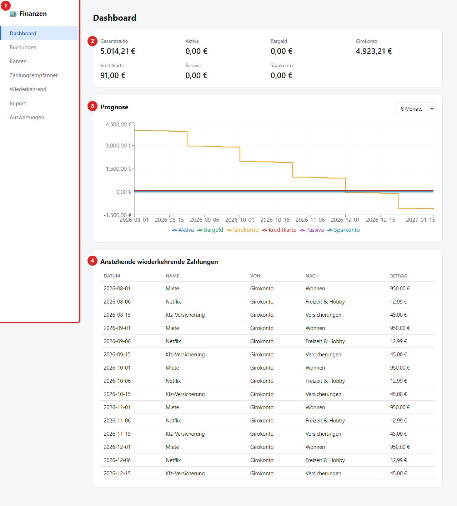

① **Navigation** — Wechsel zwischen den sieben Bereichen.
② **Kontostände** — aktueller Saldo je Konto sowie der Gesamtsaldo.
③ **Prognose** — Saldo-Verlauf der nächsten 3/6/12 Monate je Konto, basierend auf den hinterlegten wiederkehrenden Zahlungen (Abschnitt 2.4).
④ **Anstehende wiederkehrende Zahlungen** — Liste der nächsten Fälligkeiten.

### 3.2 Kontenrahmen

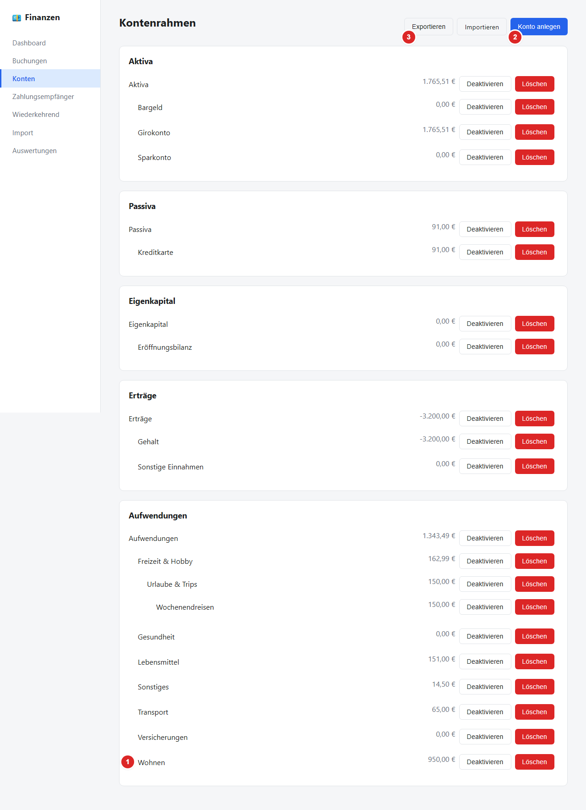

① **Kontenbaum** — beliebig tief verschachtelbar; jedes Konto zeigt seinen Saldo *inklusive* aller Unterkonten (hier sichtbar an der dreistufigen Kette Freizeit & Hobby → Urlaube & Trips → Wochenendreisen).
② **Konto anlegen** — neues Konto oder neue Kategorie hinzufügen.
③ **Exportieren/Importieren** — den kompletten Kontenrahmen als JSON-Datei sichern oder (per Merge, ohne bestehende Konten zu überschreiben) wieder einspielen.
④ **"⋯"-Menü** — pro Konto: Umbenennen (Inline-Bearbeitung direkt in der Zeile), Deaktivieren/Aktivieren, Löschen (nur möglich, wenn das Konto weder Buchungen noch Unterkonten hat — sonst stattdessen deaktivieren).

### 3.3 Buchungen

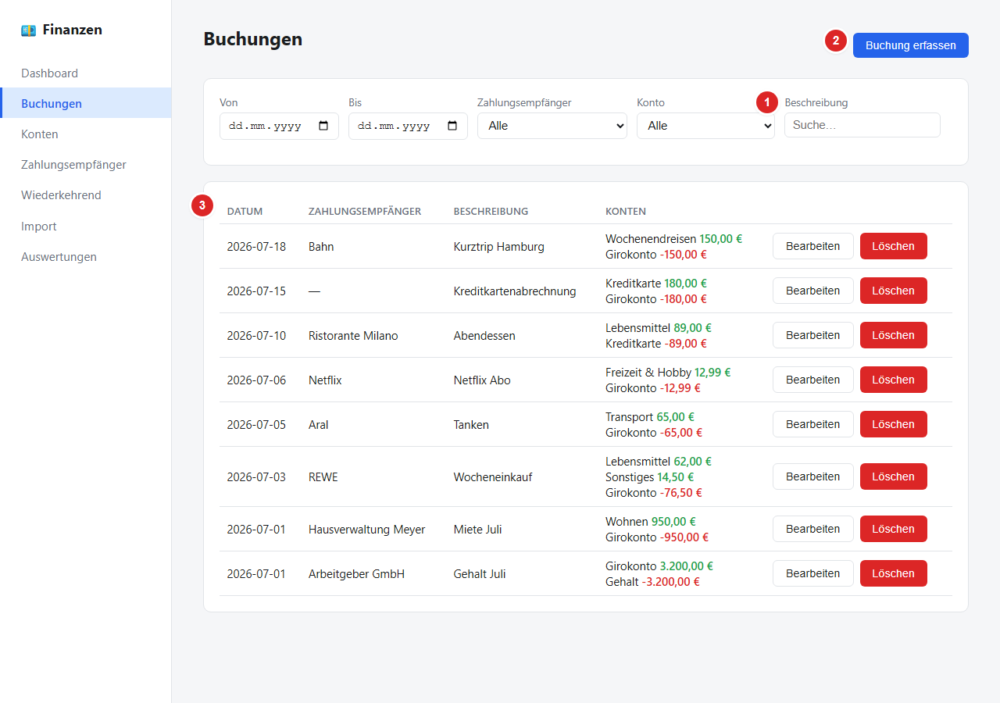

① **Filterleiste** — nach Datum, Zahlungsempfänger, Konto (inkl. Unterkonten) und Beschreibung filtern, auch kombiniert.
② **Buchung erfassen** — neue Buchung anlegen (siehe [Beispiele 1–3](#beispiel-1-die-erste-buchung-ein-gehaltseingang)).
③ **Buchungsliste** — jede Zeile zeigt Datum, Zahlungsempfänger, Beschreibung und alle beteiligten Konten mit Betrag.

### 3.4 Zahlungsempfänger

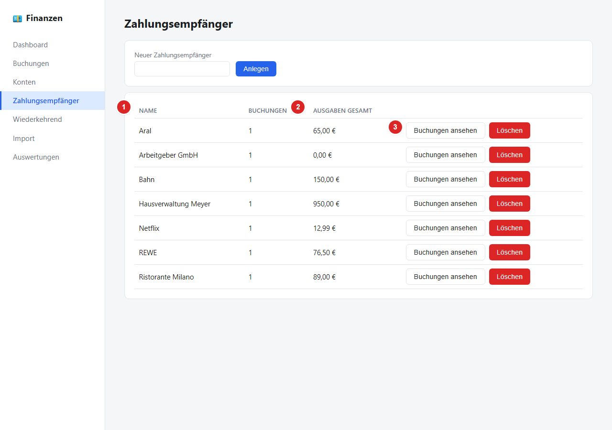

① **Name**, ② **Ausgaben gesamt** (nur Ausgaben, keine Einnahmen — daher zeigt ein Gehaltszahler hier 0,00 €), ③ **Buchungen ansehen** springt gefiltert in die Buchungsübersicht.

### 3.5 Wiederkehrende Zahlungen

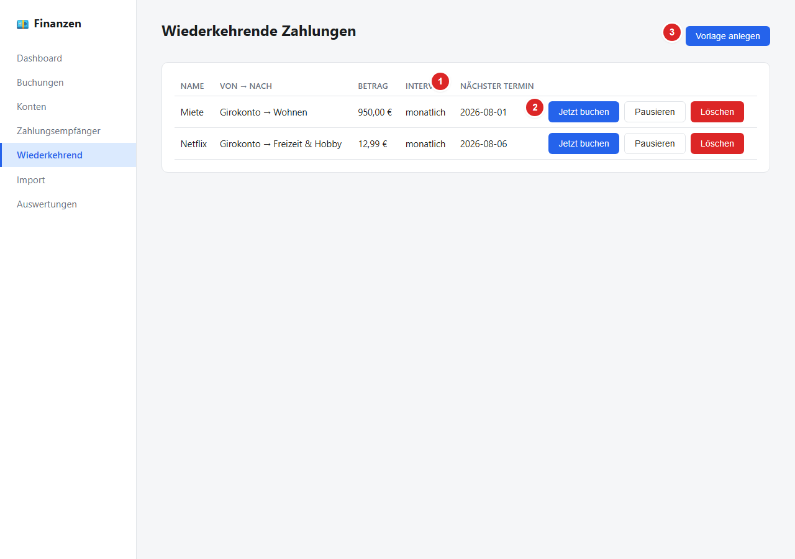

① **Nächster Termin** — automatisch berechnet aus Intervall und letzter Buchung.
② **Jetzt buchen** — die fällige Zahlung sofort als echte Buchung übernehmen, ohne auf den Termin zu warten.

### 3.6 CSV-Import

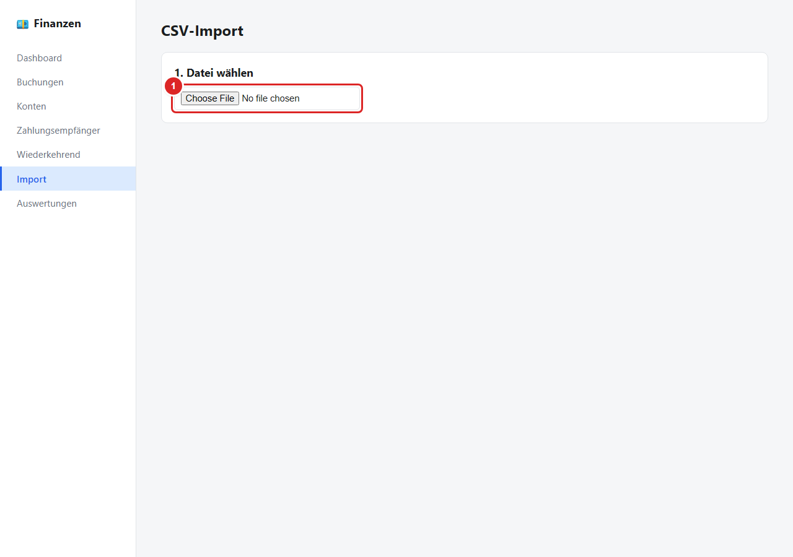

Ein dreistufiger Assistent: ① Datei auswählen, dann Spalten zuordnen und Buchungen kategorisieren — im Detail in [Beispiel 5](#beispiel-5-kontoauszug-mit-vorlage-importieren) und [Beispiel 6](#beispiel-6-kreditkarten-ausgleich-ohne-doppelbuchung).

### 3.7 Auswertungen

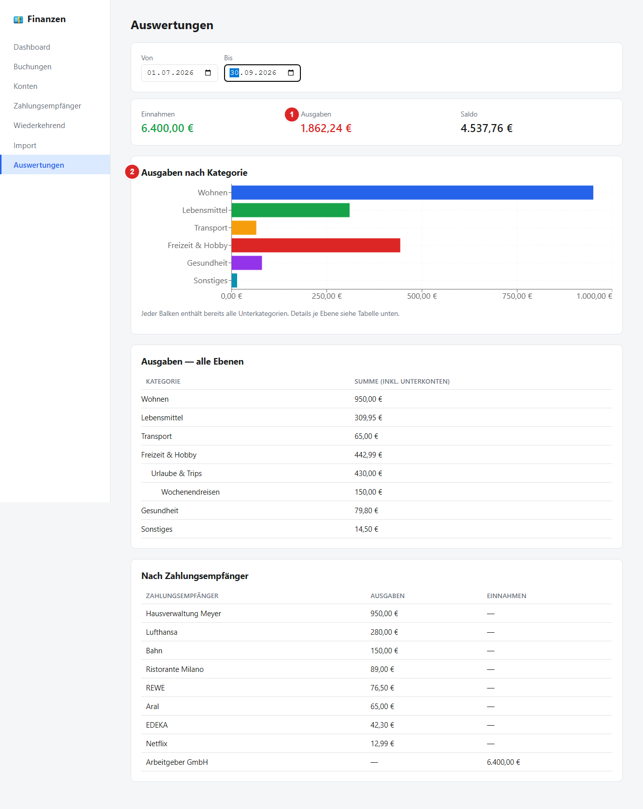

① **Gesamtsummen** für den gewählten Zeitraum. ② **Ausgaben nach Kategorie** — Balkendiagramm der obersten Kategorie-Ebene; jeder Balken enthält bereits alle Unterkategorien (mehr dazu in [Beispiel 7](#beispiel-7-mehrstufige-kategorien-auswerten)).

---

## 4. Beispiele — vom Einfachen zum Komplexen

### Beispiel 1: Die erste Buchung (ein Gehaltseingang)

Die einfachste Buchung: Geld kommt von der Kategorie *Gehalt* aufs Girokonto.

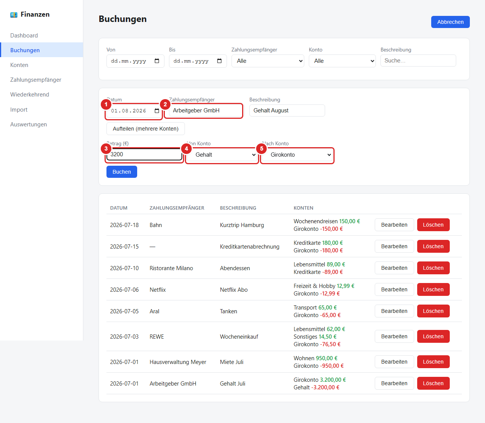

① Datum, ② Zahlungsempfänger (wird bei Bedarf automatisch neu angelegt), ③ Betrag, ④ **Von Konto** (Quelle: die Kategorie *Gehalt*), ⑤ **Nach Konto** (Ziel: *Girokonto*). Nach Klick auf "Buchen" erscheint die Buchung oben in der Liste:

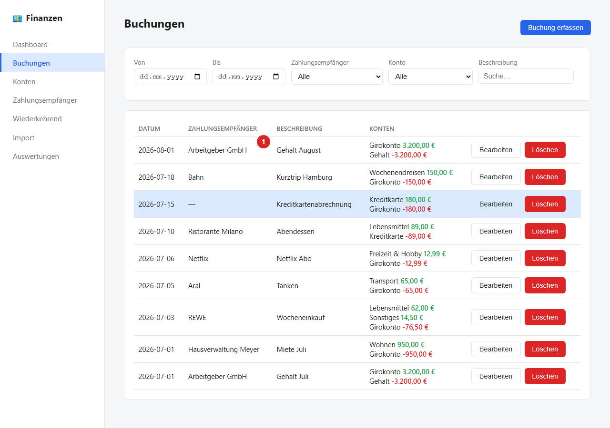

① Die neue Buchung — Girokonto wächst um 3.200 €, die Kategorie *Gehalt* nimmt den Betrag als Gegenbuchung auf.

### Beispiel 2: Eine alltägliche Ausgabe mit Zahlungsempfänger

Derselbe einfache Modus, nur umgekehrt: Geld fließt vom Girokonto zu einer Ausgabenkategorie.

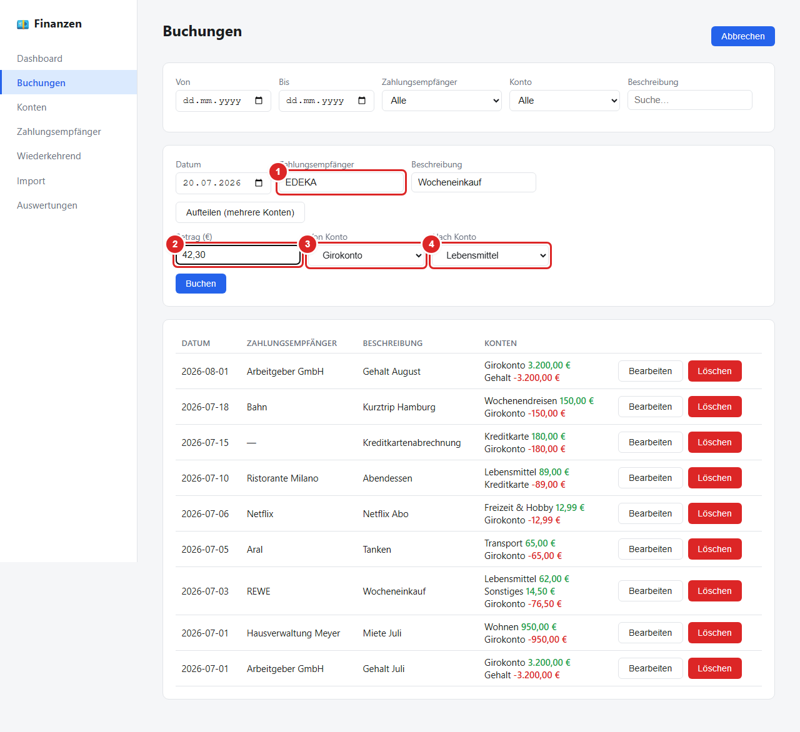

① Zahlungsempfänger "EDEKA" (wird ab jetzt bei künftigen Buchungen vorgeschlagen), ② Betrag, ③ **Von Girokonto**, ④ **Nach Lebensmittel**. Diese eine Zuordnung reicht — Fintracker bucht automatisch beide Zeilen (Girokonto −42,30 €, Lebensmittel +42,30 €).

### Beispiel 3: Eine Ausgabe auf mehrere Kategorien aufteilen

Ein Wocheneinkauf enthält oft mehr als eine Kategorie — Lebensmittel und Drogerieartikel zum Beispiel. Der **Split-Modus** erlaubt beliebig viele Buchungszeilen, solange die Summe 0 ergibt.

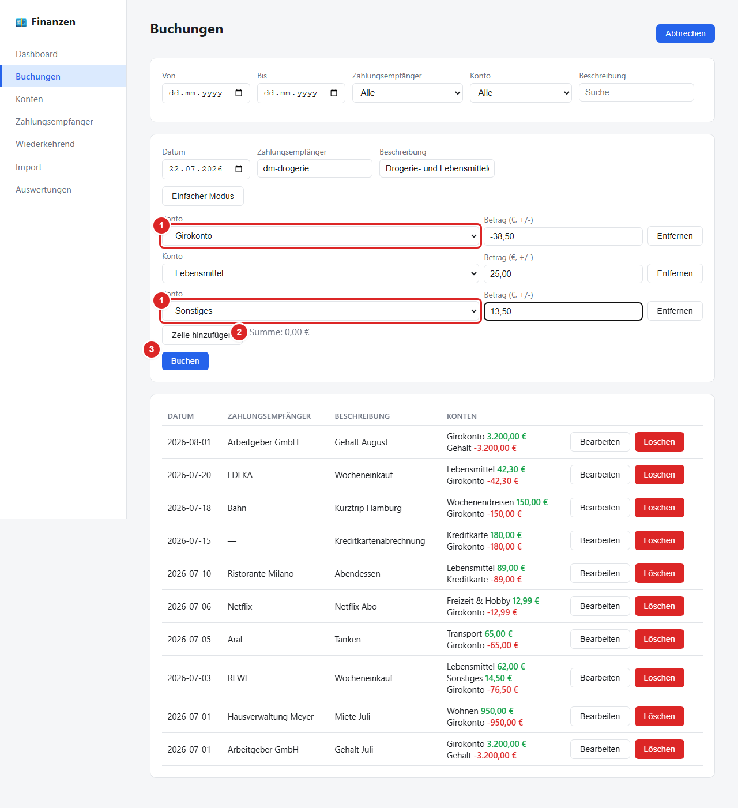

① Drei Konten-Zeilen: Girokonto −38,50 €, Lebensmittel +25,00 €, Sonstiges +13,50 €. ② Die **Summe** wird live berechnet und zeigt 0,00 € — erst dann lässt sich die Buchung speichern. ③ Mit "Zeile hinzufügen" lassen sich beliebig weitere Kategorien ergänzen.

### Beispiel 4: Eine wiederkehrende Zahlung einrichten

Statt eine Versicherung jeden Monat manuell zu buchen, wird sie einmal als Vorlage hinterlegt.

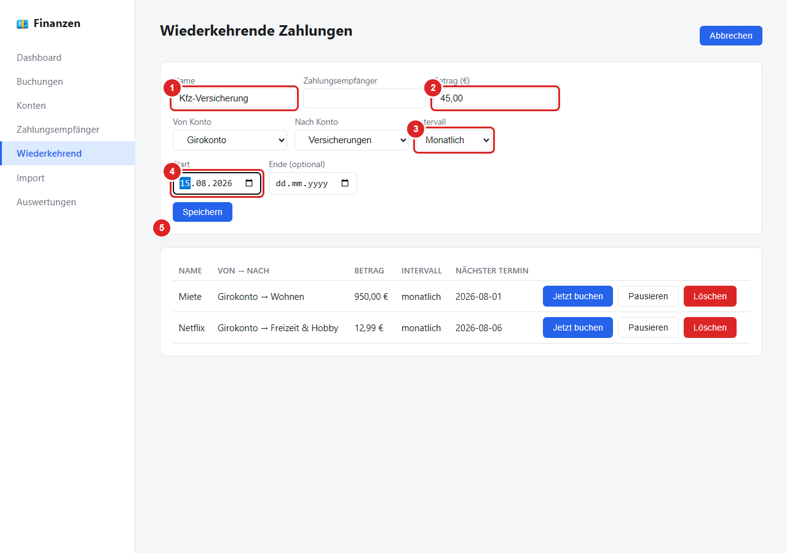

① Name, ② Betrag, ③ Intervall (wöchentlich/monatlich/jährlich), ④ Startdatum, ⑤ Speichern. Die Vorlage erscheint danach in der Liste mit automatisch berechnetem nächsten Termin:

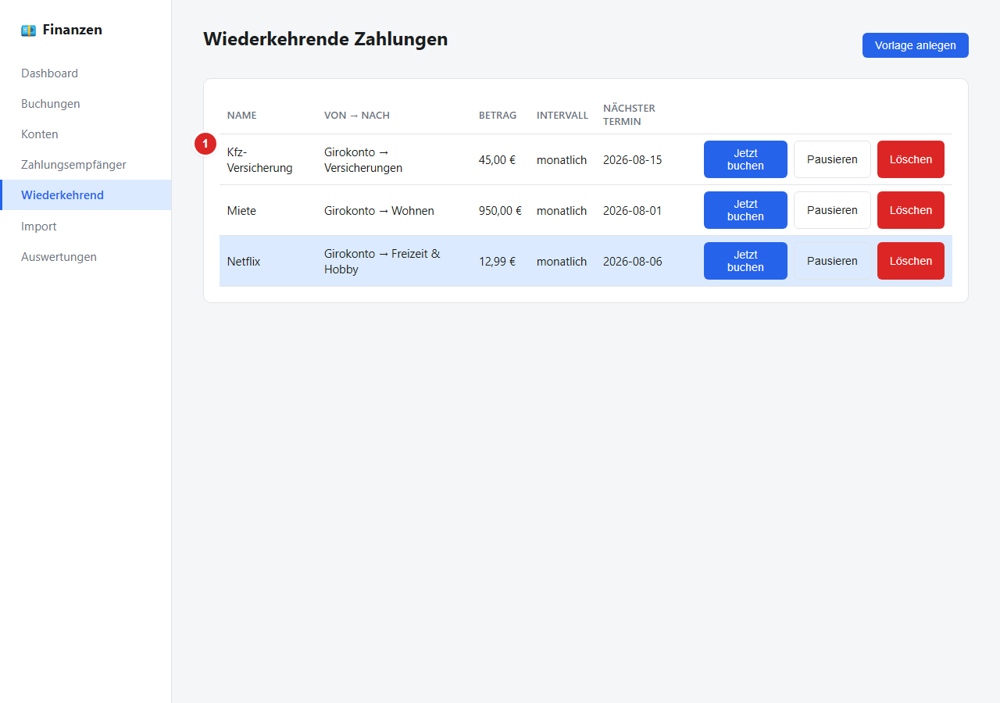

① Die neue Vorlage reiht sich nach Fälligkeit sortiert ein. Ab sofort taucht sie auch in der Dashboard-Prognose (Abschnitt 3.1, ③) auf — ganz ohne dass bereits eine Buchung existiert.

### Beispiel 5: Kontoauszug mit Vorlage importieren

Ein Kontoauszug im CSV-Format wird hochgeladen, die Spalten zugeordnet und als Vorlage gespeichert:

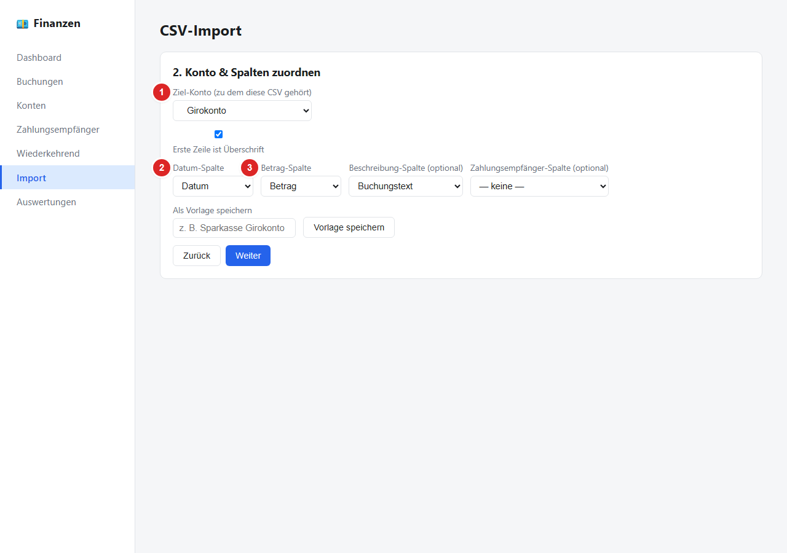

① Ziel-Konto, ② Datum-Spalte, ③ Betrag-Spalte — die Beschreibung-Spalte ("Buchungstext") wurde ebenfalls zugeordnet. Unten im Formular lässt sich diese Zuordnung unter einem Namen als Vorlage speichern.

In der Vorschau werden die Zeilen den passenden Kategorien zugewiesen:

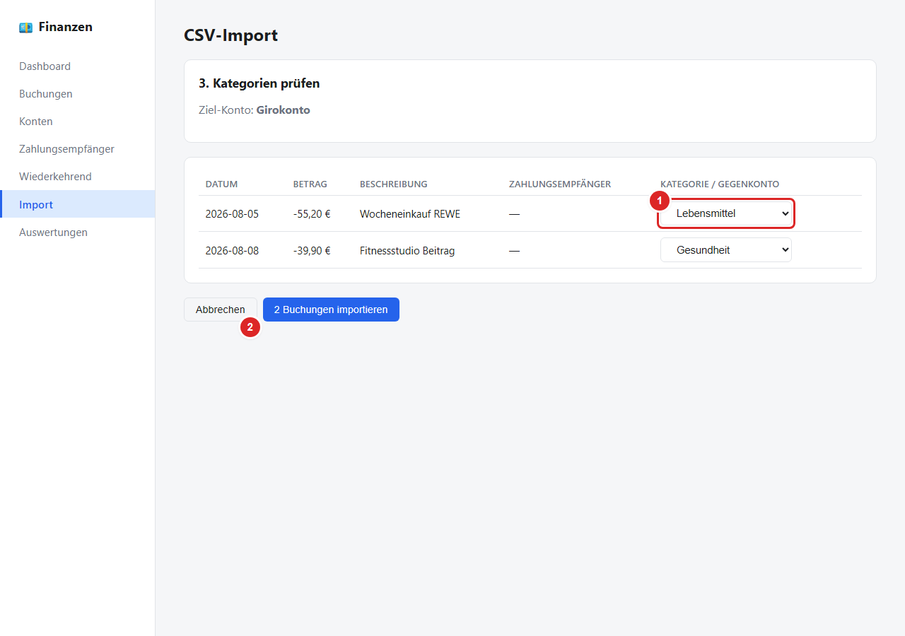

① Kategorie je Zeile wählen (bei bekannten Zahlungsempfängern wird automatisch ein Vorschlag gemacht), ② erst dann lässt sich importieren.

**Der eigentliche Nutzen zeigt sich beim nächsten Kontoauszug:**

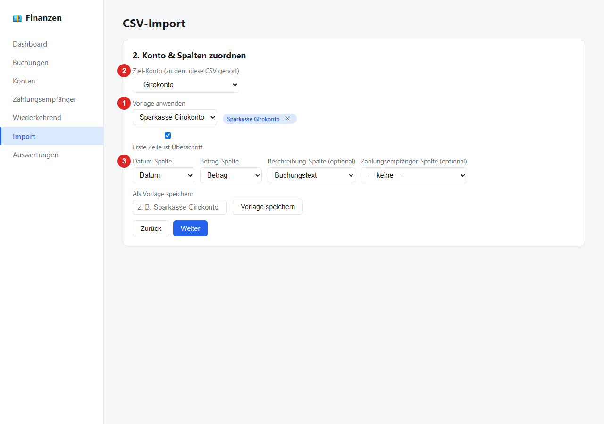

① Die gespeicherte Vorlage auswählen — ② Ziel-Konto und ③ alle Spalten-Zuordnungen werden automatisch übernommen. Der Spaltenabgleich erfolgt dabei über die Spalten-**Überschriften**, nicht über die Position — vertauscht die Bank versehentlich die Spaltenreihenfolge, erkennt Fintracker die richtigen Spalten trotzdem.

### Beispiel 6: Kreditkarten-Ausgleich ohne Doppelbuchung

Der komplexeste und zugleich alltäglichste Fall: Die monatliche Ausgleichszahlung zwischen Girokonto und Kreditkarte taucht auf **beiden** Kontoauszügen auf. Naiv importiert, würde sie doppelt gebucht.

**Schritt 1 — Import des Girokonto-Auszugs:** Die Ausgleichszeile wird nicht auf eine Ausgabenkategorie gebucht, sondern direkt auf das Konto *Kreditkarte* — die Kategorie-Auswahl akzeptiert dafür jeden Kontotyp, nicht nur Ausgabenkategorien:

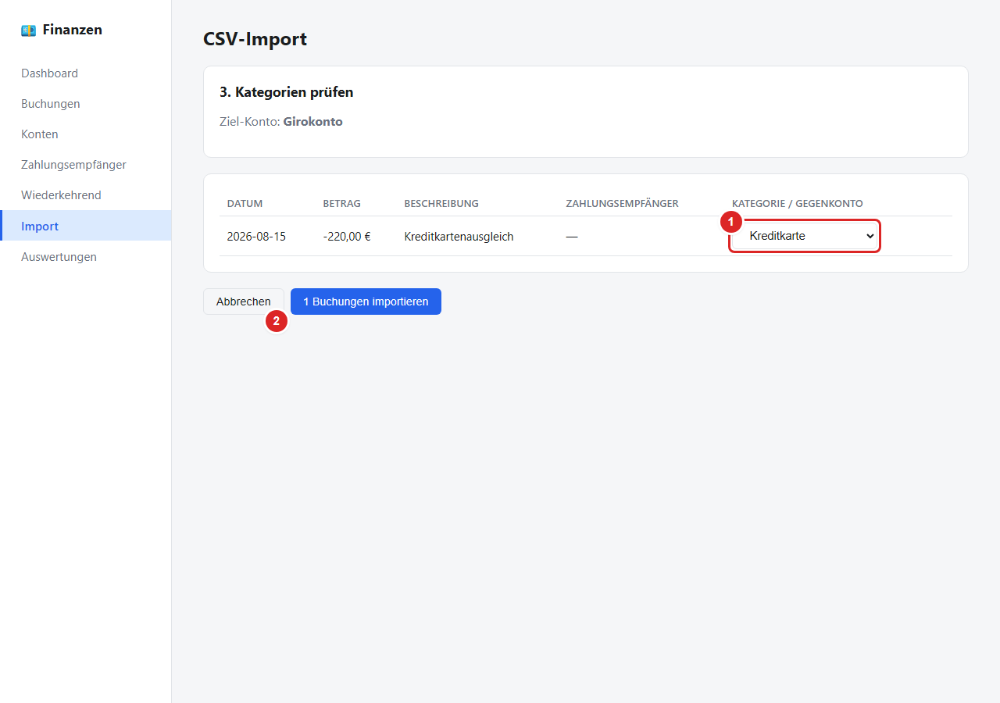

① Als "Kategorie" wird das echte Konto **Kreditkarte** gewählt statt einer Ausgabenkategorie — damit wird die Zahlung korrekt als Umbuchung zwischen zwei Konten erfasst, nicht als Ausgabe.

**Schritt 2 — Import des Kreditkarten-Auszugs**, zwei Tage später datiert (wie in der Praxis üblich, da Buchungs- und Wertstellungsdatum je Bank abweichen): Fintracker erkennt den Vorgang automatisch wieder:

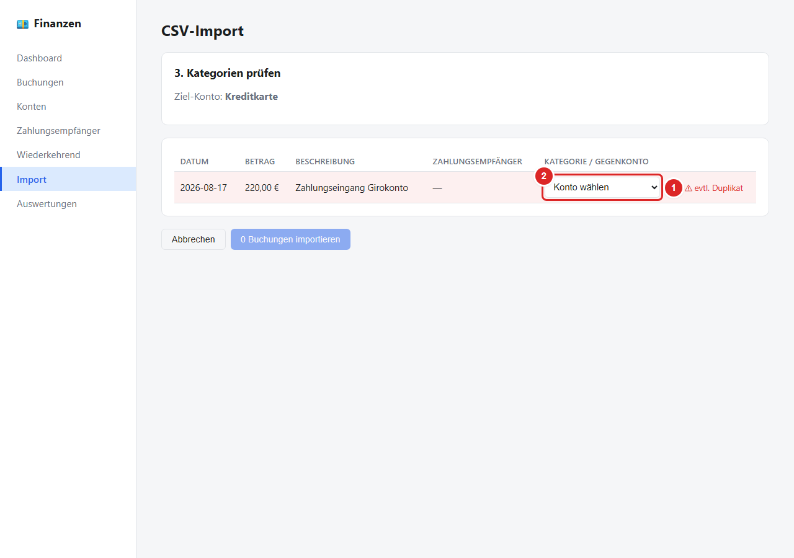

① **"⚠ evtl. Duplikat"** — Fintracker hat auf dem Konto *Kreditkarte* bereits eine Buchung mit exakt demselben Betrag innerhalb weniger Tage gefunden (den Eintrag aus Schritt 1), obwohl die Beschreibung auf diesem Auszug völlig anders lautet ("Zahlungseingang Girokonto" statt "Kreditkartenausgleich"). ② Die Kategorie bleibt deshalb automatisch leer — die Zeile wird beim Import **übersprungen**, der Button zeigt korrekt "0 Buchungen importieren". Damit landet der Vorgang genau einmal in Fintracker, nicht zweimal.

### Beispiel 7: Mehrstufige Kategorien auswerten

Kategorien lassen sich beliebig tief verschachteln — hier: `Aufwendungen → Freizeit & Hobby → Urlaube & Trips → Wochenendreisen`. Drei Buchungen wurden auf unterschiedlichen Ebenen erfasst: ein Netflix-Abo direkt auf *Freizeit & Hobby*, ein Flug auf *Urlaube & Trips*, ein Kurztrip auf *Wochenendreisen*.

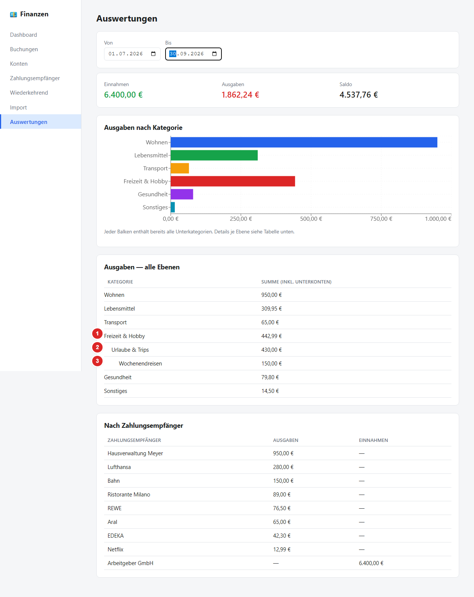

① **Freizeit & Hobby: 442,99 €** — enthält bereits alles darunter. ② **Urlaube & Trips: 430,00 €** — Flug (280 €) plus Kurztrip (150 €). ③ **Wochenendreisen: 150,00 €** — nur der Kurztrip selbst.

Wichtig beim Lesen dieser Tabelle: Die Zeilen bauen aufeinander auf und dürfen nicht addiert werden — 442,99 € *ist bereits* die Summe aus allen drei Zeilen, nicht zusätzlich zu ihnen. Für eine überschneidungsfreie Gesamtsumme (etwa im Balkendiagramm, Abschnitt 3.7) zählt nur die oberste Ebene.

---

## Weiterführend

- **Technische API-Referenz mit Beispielen:** [API_PLAYBOOK.md](API_PLAYBOOK.md)
- **Interaktive API-Dokumentation:** `http://localhost:3001/api-docs`, sobald die App läuft
- **Datenbankschema und ER-Diagramm:** [DATENMODELL.md](DATENMODELL.md)
- **Installation und Start:** [README.md](README.md)
