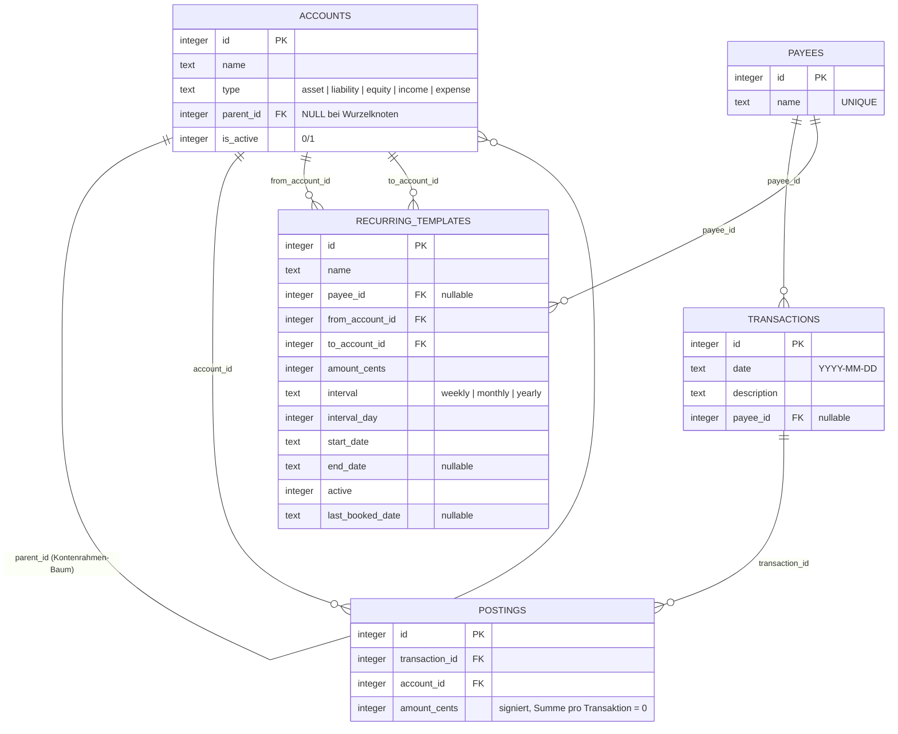

# SQLite-Datenmodell

Das Datenmodell besteht aus bewusst nur **5 Tabellen** (siehe [001_init.sql](server/src/migrations/001_init.sql)). Kategorien sind keine eigene Entität, sondern normale Konten vom Typ `income`/`expense` im Kontenrahmen — das spart eine Tabelle gegenüber klassischen Finanz-Apps.

## ER-Diagramm

## Tabellen im Detail

### `accounts` — Kontenrahmen
Selbstreferenzierender Baum (`parent_id`) für die Hierarchie Aktiva/Passiva/Eigenkapital/Erträge/Aufwendungen. Blätter unter `income`/`expense` fungieren zugleich als **Kategorien**. `is_active = 0` deaktiviert ein Konto ohne es zu löschen (Historie bleibt erhalten).

### `payees` — Zahlungsempfänger
Freie, eindeutige Liste (`UNIQUE(name)`), wird bei neuer Buchung per Autocomplete wiederverwendet oder automatisch angelegt (`findOrCreatePayee`).

### `transactions` — Buchungen
Der eigentliche Beleg: Datum, Beschreibung, optional ein Zahlungsempfänger. Enthält selbst keine Beträge — die stehen in `postings`.

### `postings` — Buchungszeilen
Herzstück der doppelten Buchhaltung: mindestens 2 Zeilen pro Transaktion, `amount_cents` ist **vorzeichenbehaftet** (positiv = Geld fließt ins Konto, negativ = Geld fließt heraus), und die Summe aller Zeilen einer Transaktion muss exakt 0 ergeben. Das ersetzt klassische Soll/Haben-Spalten durch ein einziges Vorzeichen.

### `recurring_templates` — Wiederkehrende Zahlungen
Vorlagen für Extrapolation (Prognose) und "Jetzt buchen". Fix auf **zwei** Konten (`from`/`to`) begrenzt — für Aufteilungen (z. B. Zins/Tilgung bei einer Hypothek) reicht das nicht, dafür muss weiterhin manuell mit Splits gebucht werden. `last_booked_date` verhindert, dass ein bereits verbuchtes Vorkommen erneut als "fällig" auftaucht.

## Kernentscheidung: ein Vorzeichen statt Soll/Haben

Statt zwei Spalten (Soll/Haben) hat jede Buchungszeile nur `amount_cents`:

| Kontotyp | Beispiel | Zeichen bei Zunahme |
|---|---|---|
| Aktiva | Girokonto | positiv |
| Aufwendungen | Lebensmittel | positiv |
| Passiva | Kreditkarte | **negativ** |
| Erträge | Gehalt | **negativ** |
| Eigenkapital | Eröffnungsbilanz | negativ |

Das ist weiterhin echte doppelte Buchhaltung (jede Transaktion balanciert über ≥2 Konten auf 0), nur ohne die Soll/Haben-Terminologie. In Dashboard/Auswertungen wird das Vorzeichen für Erträge zur Anzeige umgedreht, damit Einnahmen dort positiv erscheinen.
